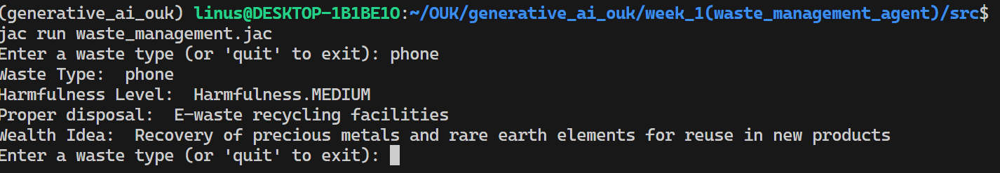

# Assignment One - Waste Management AI Agent
>
> *“We do not inherit the Earth from our ancestors, we borrow it from our children.”* — Native Proverb
<br>
I'm standing in the middle of nowhere, with waste scattered in every direction. People pass by, lost in their daily routines, without even noticing the piles around them. At the dump sites, dogs and crows fight desperately for scraps — a harsh reminder of survival in the filth. The air is heavy with a stench that chokes the lungs, and flies swarm endlessly.<br>
It makes me pause and ask: *what if Mother Earth herself is angry with us?* How long can she endure the scars we inflict on her? Even the grasses, buried beneath heaps of garbage, seem stressed and suffocated by our actions.<br>

But I believe we can change this. We have the ability — and the responsibility — to create a cleaner, more serene environment where fresh air flows freely and the earth feels alive again. <br>

That is why I built the waste-management-ai-agent. With just the type of waste a user provides, the agent responds with:

- the waste name,

- its level of harmfulness,

- safe disposal methods, and

- wealth-creation ideas from that very waste.

This project is my small step toward co-existing harmoniously with nature and protecting our planet from further harm. <br>

---

## Highlights

- CLI-driven, conversational waste analysis — just type a waste category and get actionable guidance.
- Harmfulness classification with a clear LOW/MEDIUM/HIGH scale.
- LLM-backed reasoning (Gemini 2.5 Flash) with safety guardrails to avoid unsafe suggestions.
- In-session memory: analyzed waste types are cached as graph nodes for fast repeat lookups.
- Straightforward output so the information is easy to read and share.

## How it works

This project is written in Jac and organized around a walker called `WasteAgent`.

- When you enter a waste type, the agent first searches the current graph for a matching `waste_node`.
- If none exists, it calls the LLM via `analyze_waste(...)` to derive:
  - harmfulness level,
  - proper disposal guidance, and
  - a wealth-creation idea (or "Not applicable").
- The agent filters out unsafe suggestions (e.g., burning or dumping) before saving the result.
- It then creates a new `waste_node` for this waste type and prints the summary.

Under the hood, the LLM is configured here:

```
# src/waste_management.jac
glob llm = Model(model_name="gemini/gemini-2.5-flash", verbose=False);
```

…and the main CLI loop lives in the `with entry:__main__` section of `src/waste_management.jac`.

## Project structure

```
src/
├── waste_management.jac         # Types, LLM config, CLI entry point and walker definition
└── waste_management.impl.jac    # Walker implementation: search-cache, LLM call, safeguards, print
```

## Prerequisites

- Jac toolchain (jaclang) installed
- An API key for the selected LLM provider that supports `gemini/gemini-2.5-flash`
- A modern Python environment is typically required by the Jac toolchain

If you haven’t installed Jac yet, follow the official instructions for your OS. A common approach is:

```
pip install jaclang
```

Then confirm:

```
jac --version
```

## Configuration (LLM credentials)

Set your provider API key as an environment variable before running. Replace the placeholder with your real key:

```
# Example for a shell session
export GEMINI_API_KEY={{GEMINI_API_KEY}}
```

If your environment uses a different variable name (e.g., `GOOGLE_API_KEY`), set that accordingly. Consult your LLM provider/Jac LLM integration docs for exact setup.

To switch models, edit the `model_name` passed to `Model(...)` in `src/waste_management.jac`.

## Run the CLI

From the project root:

```
jac run src/waste_management.jac
```

You’ll be prompted for a waste type repeatedly until you enter `quit`.

### Example session

```
$ jac run src/waste_management.jac
Enter a waste type (or 'quit' to exit): plastic bottles
==============================
Waste Type: plastic bottles
Harmfulness Level: medium
Proper disposal: Use local recycling streams or authorized collection centers; avoid open burning.
Wealth Idea: Upcycle into durable products (e.g., bricks, textiles) or route to PET-to-fiber programs.
==============================
Enter a waste type (or 'quit' to exit): quit
```

## Screenshots / Demo


---

If you have ideas for improving analysis quality or want to support more model backends, feel free to open an issue or a PR. Together we can make waste handling safer and smarter.

## Local setup (using uv)

These steps assume you use uv for Python environment and package management. They are provider-agnostic — choose any LLM provider and configure credentials per their documentation.

1) Create and activate a virtual environment

```
uv venv .venv
source .venv/bin/activate  # Windows: .venv\\Scripts\\activate
```

2) Install the Jac toolchain in the venv

```
uv pip install jaclang
jac --version
```

3) Configure your LLM provider

- Pick your provider (e.g., Google, OpenAI, Anthropic, etc.).
- Set the environment variables required by your provider as documented by them. See the "Configuration (LLM credentials)" section above for examples and placeholders.

4) (Optional) Select/change the model

- Edit `src/waste_management.jac` and set the `model_name` in the `Model(...)` call to a model supported by your provider.

5) Run the CLI

```
jac run src/waste_management.jac
```

Alternative: zero-install run with uvx

Without creating a venv, you can run the CLI via uvx (fetches the tool on demand):

```
uvx --from jaclang jac --version
uvx --from jaclang jac run src/waste_management.jac
```

Note: Review your provider’s documentation for exact environment variables and any additional setup steps required on your platform.

## Troubleshooting

- uv: command not found
  - Ensure uv is installed and on PATH. If you use pipx:

```
pipx install uv
pipx ensurepath
```

- Alternatively, see uv’s official install docs for your platform.

- jac: command not found
  - Activate your venv (`source .venv/bin/activate`) and install:

```
uv pip install jaclang
jac --version
```

- Or verify using uvx without a venv:

```
uvx --from jaclang jac --version
```

- Provider API key not found (authorization errors)
  - Export the correct env variable in the same shell session before running `jac`.
  - Avoid printing secrets to the terminal; store them securely (e.g., in your shell profile) if you need persistence.

- Model not supported or quota exceeded
  - Update `model_name` in `src/waste_management.jac` to a model supported by your provider, or reduce request rate/check quotas.

- Unexpected unsafe suggestions in output
  - The implementation filters common unsafe terms (e.g., "burn", "dump", "illegal", "unsafe"). You can extend these checks in `src/waste_management.impl.jac` if needed.

- Windows virtualenv activation fails
  - Use `.venv\\Scripts\\activate` in PowerShell/CMD.

## Contributing

Contributions are welcome! Please:

1) Fork the repository and create a feature branch:

```
git checkout -b feat/your-change
```

2) Set up the environment and run locally (see "Local setup (using uv)").

3) Follow safety guidelines: do not introduce suggestions that encourage burning, dumping, or other unsafe handling.

4) Keep changes focused and update the README if setup or behavior changes.

5) Commit with clear messages (Conventional Commits style is appreciated):

```
feat: add guardrails for chemical waste
fix: correct harmfulness label for e-waste
```

6) Open a Pull Request describing motivation, changes, and testing notes. For larger changes, consider opening an issue first to discuss direction.
